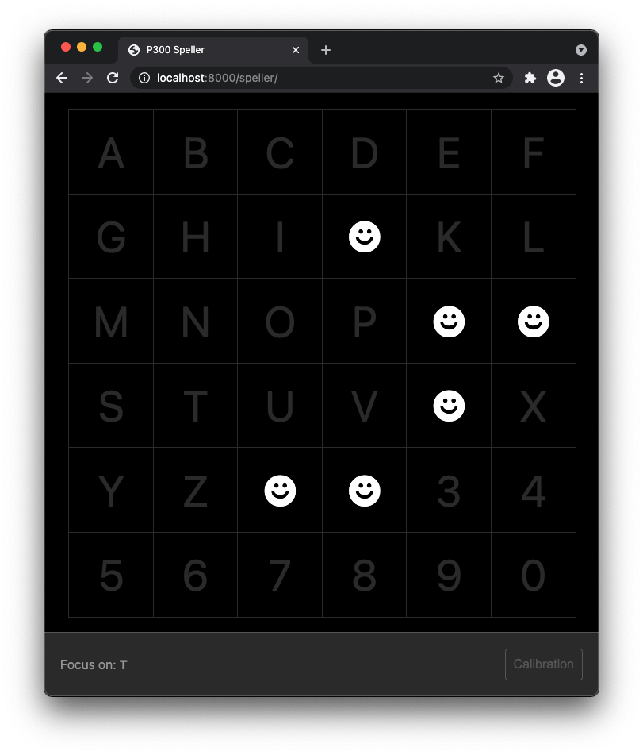
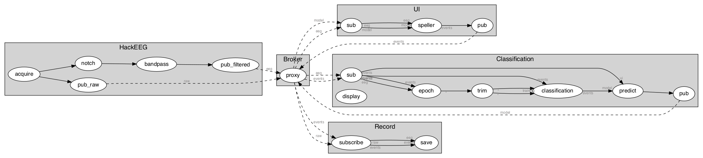

# P300 Speller



## Installation

First, [install Timeflux](https://pypi.org/project/timeflux/) in a dedicated environment. Any Python version from 3.7 to 3.9 should work, although you _may_ encounter issues with Anaconda and Python 3.9. Miniconda works great.

Then, install dependencies:

```
pip install -r requirements.txt
```

## Running the demo

Edit ``speller/main.yaml`` to reflect your acquisition system. If you do not have an EEG, you can try to uncomment the ``random.yaml`` line to generate artificial data.

Then, simply launch:

```
timeflux -d speller/main.yaml
```

The whole GUI runs in your web browser. You can monitor the EEG signal [here](http://localhost:8000/monitor) and access the main application [here](http://localhost:8000/speller).

Raw and filtered EEG data, as well as events from the classifier and the GUI, are recorded in the `data` folder.

## Application schema

This is a graphical representation of what can be found in the `.yaml` files. Do not be afraid, the syntax is actually [very easy to learn](https://doc.timeflux.io/en/stable/usage/hello_world.html)!



Note: you can generate your own application schemas with:

```
python -m timeflux.helpers.viz speller/main.yaml
```
